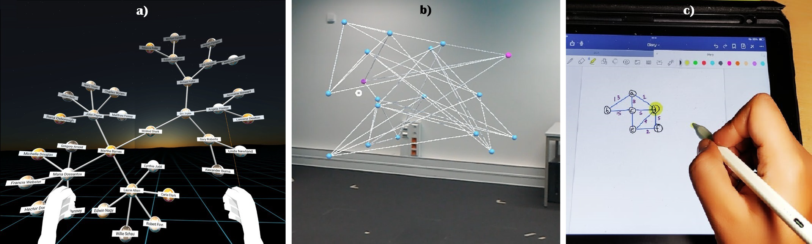

# EVA Framework: An Evaluation Benchmark for AR-VR Applications in Engineering Education

Illustrating different realities based environments, depicting a comparison in first person view. (a) Fully Immersive Virtual Reality, (b) Mixed/Augmented Reality, (c) Non-Immersive Digital Reality.
## Introduction
The **EVA Framework** is a comprehensive evaluation benchmark designed to assess the effectiveness of AR/VR/MR technologies in engineering education. The framework evaluates both technical aspects (like detection latency, tracking accuracy, rendering performance) and human factors (such as learning retention, fatigue, and user satisfaction). The framework has been tested on several devices including **Oculus Quest 2**, **Microsoft HoloLens 2**, and **iPad**, focusing on their applicability in enhancing engineering education.

## Features
- Multi-dimensional evaluation of AR/VR/MR systems in engineering education.
- Device-agnostic evaluation covering multiple platforms (Oculus Quest 2, HoloLens 2, iPad).
- Holistic approach that incorporates technical performance, user satisfaction, and learning outcomes.
- Focus on real-world engineering problems, such as:
  - Building a max-heap from a stream of numbers.
  - Finding the Minimum Spanning Tree (MST) of an undirected, weighted graph.
  - Identifying whether a graph is planar or non-planar.

## Hardware and Setup
The following devices were used for testing and evaluation:
1. **Oculus Quest 2** - Fully immersive VR setup.
2. **Microsoft HoloLens 2** - Mixed/Augmented Reality setup.
3. **Apple iPad (9th Gen)** - Handheld AR setup.
4. **Digital Pen and Paper (iPad)** - Non-immersive digital environment.
5. **Traditional Pen and Paper** - Analog environment for comparison.

## Evaluation Metrics
Participants performed tasks across different environments and their performance was evaluated based on:
- **Ease of use**
- **Interaction time**
- **Learning retention**
- **Error rates**
- **Cognitive load**
- **User engagement and satisfaction**
- **Fatigue and comfort**

## Experimental Results
The experiments involved 20 participants from various engineering backgrounds, and each participant interacted with all environments, performing a total of 300 task completions. Key insights from the study include:
- **Fully immersive VR** (Oculus Quest 2) offered high engagement and learning retention but required more time and caused increased fatigue.
- **Mixed reality** (HoloLens 2) posed a higher cognitive load but still provided effective learning outcomes.
- **Handheld AR** (iPad) was easy to start with and less tiring, though it provided lower retention compared to immersive setups.
- **Traditional pen-and-paper methods** were the easiest to start with but showed the lowest learning retention and engagement.

## Conclusion
The **EVA Framework** demonstrates that AR/VR technologies are more effective than traditional methods for engagement and retention in engineering education, though they come with higher cognitive demands and fatigue. Future work will focus on expanding the framework to other domains and integrating AI-driven real-time evaluation.

## Future Scopes
1. Expand the EVA framework to cover other domains like healthcare and architecture.
2. Improve the framework by integrating AI-driven analytics for real-time assessments.
3. Extend the evaluation to collaborative multi-user environments to understand teamwork and communication in AR/VR setups.

## Authors
- **Ahmed Raza** - Indian Institute of Technology, Bhubaneswar
- **Debi Prosad Dogra** - Indian Institute of Technology, Bhubaneswar

## Citation
If you use this framework in your research, please cite our paper:

> Raza, A., Dogra, D.P. (2023). EVA Framework: An Evaluation Benchmark for AR-VR Applications in Engineering Education. *Indian Institute of Technology, Bhubaneswar*.
